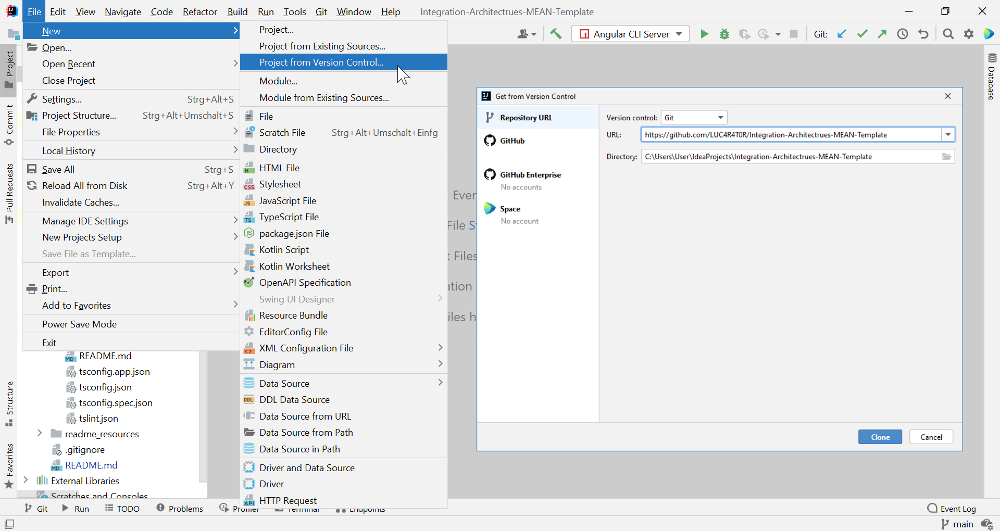
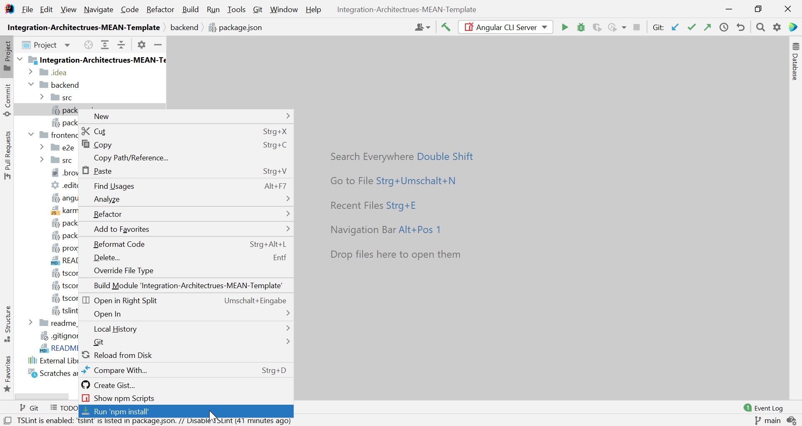

# *Integration Architectures* MEAN-Template

This template is meant to support students getting started with the Integration Architectures project.

## Prerequisites
 1. You need a **Node.js** runtime. It is available at: https://nodejs.org/ .
    
    
    Please download a version >14.x.x (The current LTS version 16.15.x works, but also the newest version 18.4.0 should
    be fine).
 
    __!!! Important: On Windows (and maybe also other operating systems) it is necessary to reboot the device after this
    step, to refresh the PATH and make `node` commands available in shell.__

 2. Access to a **MongoDB** server is necessary. If you don't have one already, you should download the community server at:
    https://www.mongodb.com/try/download/community .
    
    Upon installation, I would recommend you to select, that MongoDB
    Compass should also be installed. It's a nice GUI-application for managing MongoDB Servers and Databases.

## Setup
You can use your favourite IDE to work on your applications. But please note, that our examples mostly cover the IDEs from 
Jetbrains (IntelliJ, WebStorm etc.).

 1. **Cloning this git repository**

    You need to clone this repository. It can simply be done through your IDE or using git bash.
    
    
    In the IDEs from Jetbrains git repositories can be cloned by selecting *File > New > Project from Version Control* (Shown on the left of the screenshot).
    Also, there is a "Get from VCS" button on the welcome-screen, when no project is opened.
    Either way a dialog is displayed (shown on the right), where you can paste the URL and clone it.
   
    Alternatively git bash can be used. Simply type/paste this at the desired location:

    `git clone https://github.com/aldaGit/iar-framework`

 2. **Installing dependencies**

    The dependencies of this software can be installed with node package manager (npm). Both front- and backend need to be
    handled separately. 
    
    
    In IntelliJ and Webstorm you can just right-click the `package.json` file and select "Run 'npm install'" to install
    the dependencies.  Alternatively you navigate to the location of the `package.json` inside your shell and then run `npm install`.
      
    __Either way, this has to be done both in the directory `frontend/` and `backend/`.__

## Launching the Applications

For both front- and backend there ar run scripts included in their `package.json`.
So you can just start them by running `npm run start` in their respective directories. On Windows systems you should  start
the _backend_ with `npm run start_win`, because there environment variables are handled a little different than in Unix.

After they are done starting, the frontend can be reached from your browser at: http://localhost:4200/

You can log in with username *admin* and the password, which is printed out to the console output of the backend.
 **!!! Attention: The password will only be printed out on first startup (e.g. when no user is present in the database). So please write it down!**
In case you forgot that, you can still empty the collection 'user' in the database and restart the backend.

It is possible in IntelliJ or WebStorm, to store these start commands in a convenient way and start your applications at a push of a button.
To do so, select "Add Configuration..." at the upper right of your IntelliJ Window. A window will open, which looks like this:

In that window, you click the plus in the upper left corner and then select "npm" from the dropdown menu. This creates a new run configuration.
On the right of the window, you can give your run configuration a name, like "frontend". Also, you have to select the `package.json`. In this example, the one of the frontend.
Make sure "run" is selected as the command and "start" is selected as the script.
After that, you can save your run configuration and try it out.
These steps have to be repeated for the backend. In this case, obviously selecting the `package.json` of the backend.

### Result

If your Login was successful, you will see this page:

